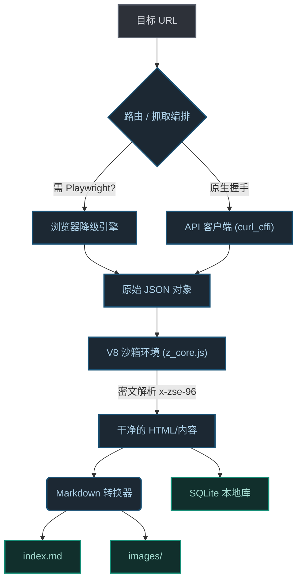

<div align="center">

# 🕷️ Zhihu Scraper
**为数据科学与大模型语料设计的高雅、稳定的知乎内容提取器**

<p align="center">
  
  
  
  
</p>

<p align="center">
  <strong>
    简体中文 | 
    <a href="README_EN.md">English</a>
  </strong>
</p>

[**🚀 快速开始**](#-快速开始) | [**🧠 项目哲学**](#-项目哲学-为什么选择它) | [**🏗️ 架构设计**](#-基础设施与架构设计) | [**📊 产出预览**](#-精选数据产出) | [**📖 完整文档**](#-完整技术细节供复盘参考)

</div>

---

## 🧠 项目哲学 (为什么选择它？)

抓取知乎内容历来是一场针对 `x-zse-96` 签名、严格的 `zse_ck` Cookie 校验以及频繁的 Cloudflare/WAF 拦截的持久战。

`zhihu-scraper` 不仅仅是一个脚本；它是一个**工程级的数据管道**。它摒弃了脆弱的 CSS 选择器，转而与知乎后端进行原生的底层 JSON API 握手，在无需浏览器开销（除非必要）的情况下，提供高度流畅且高性能的提取体验。

### ✨ 核心特性
- 🚀 **零开销原生握手：** 使用 `curl_cffi` 完美模拟 Chrome 底层 TLS/HTTP2 指纹，静默绕过网关。
- 🛡️ **智能 Cookie 池与自动降级：** 通过 JSON 池自动轮换身份。若遭遇强力拦截，系统会平滑降级至无头 Playwright 实例，突破“知乎专栏”的硬核防线。
- 📦 **双引擎持久化：** 内容不只是简单的堆砌。它被优雅地解析为排版精美的 `Markdown`（支持完美的 LaTeX 数学公式）并结构化地 `UPSERT` 到本地 `SQLite` 知识库中。
- 🔄 **增量监控运行：** 专用的 `monitor` 模式，利用状态指针（Last ID）追踪进度。即使是上万条的收藏夹，也能通过 Cron 任务轻松实现只抓取增量数据。

---

## 🚀 快速开始

### 前置要求

- **Python 3.10** 或更高版本
- **Git**

### 安装方式

#### 方式一：一键安装（推荐）

```bash
# 克隆并进入项目
git clone https://github.com/yuchenzhu-research/zhihu-scraper.git
cd zhihu-scraper

# 一键安装（自动创建环境、安装依赖、配置浏览器）
./install.sh
```

#### 方式二：从 PyPI 安装

```bash
pip install zhihu-scraper
zhihu interactive  # 启动交互式界面
```

#### 方式三：从源码运行（开发者）

```bash
# 1. 克隆项目
git clone https://github.com/yuchenzhu-research/zhihu-scraper.git
cd zhihu-scraper

# 2. 创建虚拟环境
python3 -m venv .venv
source .venv/bin/activate  # macOS/Linux
# Windows: .venv\Scripts\activate

# 3. 安装依赖（包含浏览器引擎）
pip install -e ".[full]"

# 4. 安装 Playwright 浏览器
playwright install chromium
```

### 快速运行

```bash
# 激活环境（如果用方式一/三，需要先激活）
source .venv/bin/activate

# 抓取单个链接
./zhihu fetch "https://www.zhihu.com/p/123456"

# 交互式界面（推荐）
./zhihu interactive
```

### 🔑 配置 Cookie（推荐）

如果遇到访问限制，可以配置知乎 Cookie：

1. 用浏览器登录知乎（F12 → Network → 任意请求 → 复制 `cookie` 值）
2. 编辑项目根目录下的 `cookies.json`：
```json
[
    {
        "name": "z_c0",
        "value": "你的z_c0值",
        "domain": ".zhihu.com"
    },
    {
        "name": "d_c0",
        "value": "你的d_c0值",
        "domain": ".zhihu.com"
    }
]
```

> 💡 **提示**：核心字段是 `z_c0` 和 `d_c0`，不配置 Cookie 也可以游客身份运行，但部分内容可能受限。

> 📁 **多账号池**：可创建 `cookie_pool/*.json` 文件支持自动轮换

---

## 📦 5 秒极速提取

在终端中粘贴任何知乎链接（回答、文章或问题）。

```bash
# 激活环境
source .venv/bin/activate

# 直接抓取
./zhihu fetch "https://www.zhihu.com/question/123456/answer/987654"

# 或交互式界面
./zhihu interactive
```

*想要构建自己的 Agent 数据管道？这是 Python SDK 的调用方式：*

```python
import asyncio
from core.scraper import ZhihuDownloader
from core.converter import ZhihuConverter

async def extract_knowledge():
    # 1. 初始化针对某个回答的下载器
    url = "https://www.zhihu.com/question/28696373/answer/2835848212"
    downloader = ZhihuDownloader(url)
    
    # 2. 从 API 获取原始数据
    data = await downloader.fetch_page()
    
    # 3. 转换为纯净的 Markdown（自动处理 LaTeX）
    converter = ZhihuConverter()
    markdown_text = converter.convert(data['html'])
    
    print(markdown_text[:200]) # 完美适配 LLM 语料输入

asyncio.run(extract_knowledge())
```

---

## 📊 精选数据产出

`zhihu-scraper` 的输出被设计为一件精致的数字展品。它将混乱的网络源码标准化为机器可读的代码艺术。

### 本地文件系统
使用 CLI 时，数据会井然有序地存储：
```text
data/
├── [2026-02-22] 深入理解大模型的底层逻辑/
│   ├── index.md           # 纯净的 Markdown 文件
│   └── images/            # 本地存储的图片，已绕过防盗链
└── zhihu.db               # 本地 SQLite 全文知识库
```

### 结构化 JSON (SQLite 实体)
提取的核心数据对象经过完美结构化，可直接用于 RAG (检索增强生成) 数据库：

```json
{
  "type": "answer",
  "answer_id": "2835848212",
  "question_id": "28696373",
  "author": "Tech Whisperer",
  "title": "深入理解大模型的底层逻辑",
  "voteup_count": 14205,
  "created_at": "2023-01-15T08:32:00Z",
  "html": "<p>大语言模型 (LLM) 本质上是在...</p>"
}
```

---

## 🏗️ 基础设施与架构设计

该项目严格遵循领驱动设计 (DDD)，将提取机制、Markdown 解析和数据持久层完美解耦。



---

## 🕹️ 五大 CLI 工作流

CLI 提供了以下命令（使用 `python3 -m cli.app` 或 `./zhihu` 调用）：

1. **`python3 -m cli.app interactive`** (✨ 推荐): 启动交互式终端 UI (TUI)，直观配置批量任务和检索。
2. **`python3 -m cli.app fetch [URL]`**: 带有图片下载功能的单条稳定提取。
3. **`python3 -m cli.app batch [FILE]`**: 通过文本文件提供 URL 列表。自动启动异步、限频的线程池 (`-c 8`)。
4. **`python3 -m cli.app monitor [ID]`**: “自动化 Cron”功能。提供收藏夹 ID，仅抓取最新增量。
5. **`python3 -m cli.app query “[关键词]”`**: 对所有已下载 Markdown 文件进行本地检索。

---

## ❓ 常见问题

### Q: 报错 "Cookie required" 怎么办？
A: 编辑 `cookies.json`，填入登录知乎后的 Cookie 值。获取方法：浏览器登录知乎 → F12 → Network → 任意请求 → Request Headers → 复制 `cookie`。

### Q: 速度太慢/被限流？
A:
- 检查网络连接
- 调整 `config.yaml` 中的 `humanize.min_delay` 和 `humanize.max_delay` 增大间隔
- 确保 Cookie 有效

### Q: 提取失败/被知乎拦截？
A: 项目会自动降级到 Playwright 模式。请勿设置过高并发或过快请求频率。等待几分钟后重试。

### Q: 能在 Windows 上运行吗？
A: 支持！确保安装 Python 3.10+ 和 Git 后，使用 PowerShell 按上述步骤操作即可。

### Q: 图片下载失败？
A: 图片下载需要正确的 `referer` 头，项目已默认配置。如仍失败，检查网络是否能访问知乎图床。

---

## 🤝 参与贡献

欢迎任何形式的贡献！本项目正不断突破非结构化 Web 数据解析的边界。

```bash
git clone https://github.com/yuchenzhu-research/zhihu-scraper.git
cd zhihu-scraper
pip install -e ".[dev]"
```

提交 Pull Request 之前，请确保运行 `ruff` 和 `pytest`。

<p align="center">
  <br>
  <b><a href="#top">⬆ 返回顶部</a></b>
</p>

---

*📝 **免责声明：** 本框架仅供学术研究和个人存档使用。严禁将底层 HTTP 认证指纹解析用于商业化或非法 DDoS 活动。针对因配置过高并发导致账户受限的情况，维护者不承担任何责任。*
---

## 🕹️ 五大 CLI 工作流

CLI 提供了以下命令（使用 `python3 -m cli.app` 或 `./zhihu` 调用）：

| 命令 | 说明 | 示例 |
|------|------|------|
| `interactive` | ✨ 推荐：启动交互式终端 UI | `./zhihu interactive` |
| `fetch` | 抓取单个知乎链接，支持图片下载 | `./zhihu fetch "url"` |
| `batch` | 批量抓取 URL 列表，自动并发限频 | `./zhihu batch urls.txt -c 8` |
| `monitor` | 增量监控收藏夹，记录进度指针 | `./zhihu monitor 78170682` |
| `query` | 在 SQLite 数据库中检索内容 | `./zhihu query "关键词"` |
| `config` | 查看当前配置 | `./zhihu config --show` |
| `check` | 检查环境依赖 | `./zhihu check` |

### 详细命令参数

#### fetch 命令
```bash
zhihu fetch "URL" [OPTIONS]
# -o, --output PATH    输出目录 (默认 ./data)
# -n, --limit INT      限制回答数量 (仅问题页)
# -i, --no-images      不下载图片
# -b, --headless       无头模式运行浏览器
```

#### batch 命令
```bash
zhihu batch FILE [OPTIONS]
# -o, --output PATH    输出目录 (默认 ./data)
# -c, --concurrency INT 并发数 (建议 4-8)
# -i, --no-images      不下载图片
# -b, --headless       无头模式
```

#### monitor 命令
```bash
zhihu monitor COLLECTION_ID [OPTIONS]
# -o, --output PATH    输出目录 (默认 ./data)
# -c, --concurrency INT 并发数
# -i, --no-images      不下载图片
# -b, --headless       无头模式
```

#### query 命令
```bash
zhihu query "KEYWORD" [OPTIONS]
# -l, --limit INT      最大显示结果数量 (默认 10)
# -d, --data-dir PATH  数据目录 (默认 ./data)
```

---

## 📊 精选数据产出

`zhihu-scraper` 的输出被设计为一件精致的数字展品。它将混乱的网络源码标准化为机器可读的代码艺术。

### 本地文件系统

使用 CLI 时，数据会井然有序地存储：
```
data/
├── [2026-02-22] 深入理解大模型的底层逻辑/
│   ├── index.md           # 纯净的 Markdown 文件
│   └── images/            # 本地存储的图片，已绕过防盗链
│       ├── v2-abc123.jpg
│       └── v2-def456.jpg
├── [2026-02-21] 另一个问题标题/
└── zhihu.db               # 本地 SQLite 全文知识库
```

### SQLite 数据库结构

```sql
-- 文章/回答表
CREATE TABLE articles (
    id INTEGER PRIMARY KEY AUTOINCREMENT,
    answer_id TEXT UNIQUE NOT NULL,  -- 知乎回答/文章 ID
    type TEXT NOT NULL,              -- 类型: 'answer' 或 'article'
    title TEXT,                      -- 标题
    author TEXT,                     -- 作者
    url TEXT,                        -- 原始链接
    content_md TEXT,                 -- 完整 Markdown 内容
    collection_id TEXT,              -- 来自哪个收藏夹
    created_at TIMESTAMP,            -- 入库时间
    updated_at TIMESTAMP             -- 更新时间
);

-- 索引
CREATE INDEX idx_author ON articles(author);
CREATE INDEX idx_collection ON articles(collection_id);
```

### 结构化 JSON 输出

提取的核心数据对象经过完美结构化，可直接用于 RAG (检索增强生成) 数据库：

```json
{
  "id": "2835848212",
  "type": "answer",
  "url": "https://www.zhihu.com/question/28696373/answer/2835848212",
  "title": "深入理解大模型的底层逻辑",
  "author": "Tech Whisperer",
  "content": "<p>大语言模型 (LLM) 本质上是在...</p>",
  "html": "...",
  "date": "2026-02-22",
  "upvotes": 14205
}
```

---

## 📖 完整技术细节（供复盘参考）

### 1. curl_cffi API 模式 vs Playwright 降级

**API 模式优先策略：**
```
curl_cffi (chromium/edge 指纹) → 知乎 API v4 → JSON 数据
```

**降级触发条件：**
- API 返回 403 状态码
- API 返回空数据或异常
- 专栏文章 (zhuanlan.zhihu.com) API 解析失败

**降级流程：**
```
API 失败 → 打印警告 → 启动 Playwright 浏览器 → 注入 Cookie → 渲染页面 → 提取 DOM
```

### 2. TLS 指纹伪装

```python
# 使用 curl_cffi 模拟 Chrome 110
session = requests.Session(impersonate="chrome110")

# 关键请求头
headers = {
    "User-Agent": "Mozilla/5.0 (Macintosh; Intel Mac OS X 10_15_7) AppleWebKit/537.36...",
    "Accept": "application/json, text/plain, */*",
    "Accept-Language": "zh-CN,zh;q=0.9,en;q=0.8",
    "Referer": "https://www.zhihu.com/",
}
```

### 3. x-zse-96 签名生成

知乎 API 请求需要 `x-zse-96` 签名头：

```python
# z_core.js 中的签名逻辑（由 execjs 执行）
sig_headers = js_ctx.call("get_sign", api_path, f"d_c0={d_c0}")
# 返回: {"x-zse-96": "...", "x-zse-101": "..."}
```

### 4. 反风控策略

| 场景 | 策略 |
|------|------|
| 任务间延迟 | 随机 0.5~6 秒均匀分布 |
| 并发控制 | 信号量限制 max 8 |
| Cookie 轮换 | 403 时自动切换账号 |
| 浏览器降级 | 强风控路由自动切换 |

### 5. 图片去重算法

知乎图片命名规则示例：
- `v2-abc123_720w.jpg` (720px 宽)
- `v2-abc123_r.jpg` (高清)
- `v2-abc123_l.jpg` (超高分辨)

**去重逻辑：**
```python
base_name = url.split("/")[-1].split("?")[0]
for suffix in ["_720w", "_r", "_l"]:
    if base_name.endswith(suffix + ".jpg"):
        base_name = base_name.replace(suffix + ".jpg", ".jpg")
        break
# 只保留 v2-abc123.jpg
```

### 6. LaTeX 数学公式处理

**知乎格式：**
```html
<span class="ztext-math" data-tex="$\sum_{i=1}^{n} i^2$">
```

**转换后 Markdown：**
```markdown
$\sum_{i=1}^{n} i^2$
```

**KaTeX 兼容性处理：**
```python
# array 列数重复语法展开
# {*{20}{c}} → {cccccccccccccccccccc}
```

---