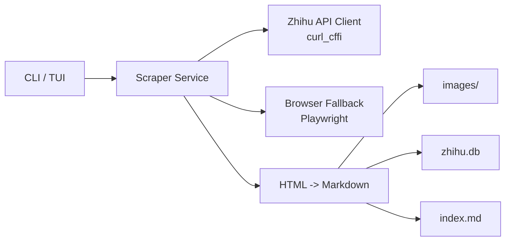
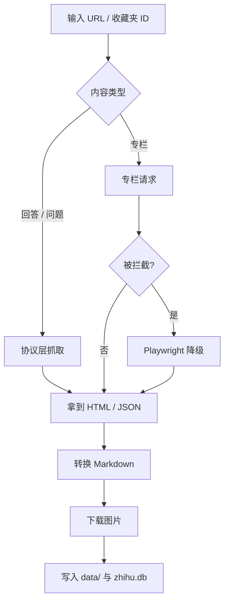

<div align="center">

# Zhihu Scraper
**面向本地归档的知乎内容提取工具。优先走协议层，必要时降级 Playwright，结果同时落盘 Markdown 和 SQLite。**

<p align="center">
  
  
  
</p>

<p align="center">
  <strong>
    简体中文 |
    <a href="README_EN.md">English</a>
  </strong>
</p>

</div>

> 仅供学术研究和个人学习使用。请遵守知乎服务条款，不要把 `cookies.json` 提交到仓库。

## 为什么用它

- 协议层优先：回答、问题页、收藏夹监控默认走 `curl_cffi`
- 智能兜底：专栏文章遇到 403 时可降级到 Playwright
- 本地归档：输出 Markdown、图片目录和 `zhihu.db`
- 适合个人知识库：抓完就能检索，不依赖在线服务

## 5 分钟开始

### 1. 环境

- Python `3.10+`
- 建议安装 Node.js，供 `PyExecJS` 使用
- 如需专栏降级，安装 Playwright 浏览器

### 2. 安装

```bash
git clone https://github.com/yuchenzhu-research/zhihu-scraper.git
cd zhihu-scraper
./install.sh
```

### 3. 准备 Cookie

本地 `cookies.json` 至少建议放这两个字段：

```json
[
  {"name": "z_c0", "value": "你的 z_c0", "domain": ".zhihu.com"},
  {"name": "d_c0", "value": "你的 d_c0", "domain": ".zhihu.com"}
]
```

获取方法：

1. 登录 `https://www.zhihu.com`
2. 打开开发者工具
3. 在 `Application -> Cookies` 或 `Network -> Request Headers` 找到 `z_c0` / `d_c0`
4. 保存到本地 `cookies.json`

### 4. 跑第一条

```bash
./zhihu fetch "https://www.zhihu.com/question/28696373/answer/2835848212"
```

如果 `./zhihu` 没有执行权限：

```bash
python3 cli/app.py fetch "https://www.zhihu.com/question/28696373/answer/2835848212"
```

## 支持范围

| 内容类型 | 无 Cookie | 有 Cookie | 说明 |
|---|---|---|---|
| 单条回答 | 可用 | 可用 | 最稳定 |
| 问题页回答列表 | 受限 | 可用 | 游客模式通常只能拿到少量回答 |
| 专栏文章 | 容易被拦截 | 可用 | 失败时可降级 Playwright |
| 收藏夹监控 | 不推荐 | 可用 | 依赖登录态更稳 |

## 常用命令

| 命令 | 作用 | 示例 |
|---|---|---|
| `fetch` | 抓单条链接，或从文本中提取多条链接 | `./zhihu fetch "URL"` |
| `batch` | 批量抓文件中的链接 | `./zhihu batch urls.txt -c 4` |
| `monitor` | 增量监控收藏夹 | `./zhihu monitor 78170682` |
| `query` | 搜索本地数据库 | `./zhihu query "Transformer"` |
| `interactive` | 启动交互界面 | `./zhihu interactive` |
| `config` | 查看当前配置 | `./zhihu config --show` |
| `check` | 检查依赖和运行环境 | `./zhihu check` |

## 架构概览



设计原则很简单：

- 浏览器不是主路径，只做兜底。
- 抓取和本地归档是第一优先级，不做在线平台依赖。

## 执行流程



## 项目结构

```text
cli/           命令行入口与交互界面
core/          抓取、转换、数据库、监控等核心逻辑
static/        签名脚本与静态资源
data/          本地输出目录，默认不提交
browser_data/  浏览器运行数据，默认不提交
```

## 输出结果

默认写入 `data/`：

```text
data/
├── [2026-03-06] 标题 (answer-1234567890)/
│   ├── index.md
│   └── images/
└── zhihu.db
```

数据库里会保存：

- 内容 ID 与类型
- 标题、作者、来源 URL
- 转换后的 Markdown
- 监控模式下的收藏夹关联

## 本地开发

安装开发依赖：

```bash
pip install -e ".[dev]"
```

常用检查：

```bash
python3 -m compileall cli core
python3 cli/app.py check
pytest
ruff check cli core
```

## 常见问题

### `check` 提示 Playwright 未安装

协议层依然能用，只是专栏降级不可用：

```bash
pip install -e ".[full]"
playwright install chromium
```

### 为什么游客模式抓不到完整问题页

这是知乎侧的可见性限制，不是脚本本身遗漏。

### 为什么专栏偶尔还是失败

专栏风控比回答更强，通常需要更新 Cookie、重新登录，或等待会话恢复。

### 为什么 `cookies.json` 不能进 Git

它本质上是登录凭据。哪怕后续删除文件，只要进过 commit 历史，就已经算泄漏。
