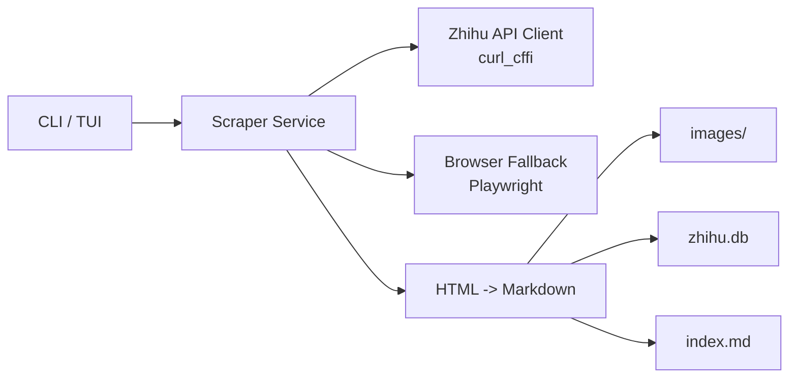
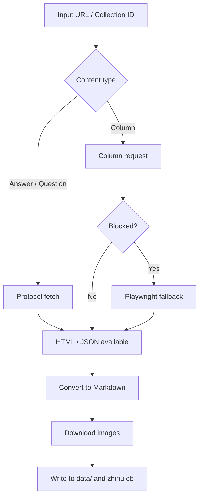

<div align="center">

# Zhihu Scraper
**A local-first Zhihu extraction tool. It prefers protocol-layer fetching, falls back to Playwright when needed, and archives results as Markdown plus SQLite.**

<p align="center">
  
  
  
</p>

<p align="center">
  <strong>
    <a href="README.md">简体中文</a> |
    English
  </strong>
</p>

</div>

> For academic research and personal learning only. Please respect Zhihu's Terms of Service, and never commit `cookies.json`.

## Why This Project

- Protocol-first: answers, question pages, and collection monitoring primarily use `curl_cffi`
- Practical fallback: column pages can fall back to Playwright when blocked
- Local archive: output includes Markdown files, downloaded images, and `zhihu.db`
- Built for personal knowledge bases: scrape first, organize and search later

## 5-Minute Setup

### 1. Requirements

- Python `3.10+`
- Node.js is recommended for `PyExecJS`
- Playwright browser binaries if you want column fallback

### 2. Install

```bash
git clone https://github.com/yuchenzhu-research/zhihu-scraper.git
cd zhihu-scraper
./install.sh
```

### 3. Prepare Cookies

Your local `cookies.json` should ideally contain at least:

```json
[
  {"name": "z_c0", "value": "your z_c0", "domain": ".zhihu.com"},
  {"name": "d_c0", "value": "your d_c0", "domain": ".zhihu.com"}
]
```

How to get them:

1. Sign in at `https://www.zhihu.com`
2. Open browser developer tools
3. Find `z_c0` and `d_c0` in `Application -> Cookies` or `Network -> Request Headers`
4. Save them into local `cookies.json`

### 4. Run Your First Fetch

```bash
./zhihu fetch "https://www.zhihu.com/question/28696373/answer/2835848212"
```

If `./zhihu` is not executable:

```bash
python3 cli/app.py fetch "https://www.zhihu.com/question/28696373/answer/2835848212"
```

## Support Matrix

| Content Type | Without Cookie | With Cookie | Notes |
|---|---|---|---|
| Single answer | Works | Works | Most stable path |
| Question page answers | Limited | Works | Guest mode usually sees only a subset |
| Column article | Often blocked | Works | Can fall back to Playwright |
| Collection monitoring | Not recommended | Works | Logged-in sessions are more reliable |

## Common Commands

| Command | Purpose | Example |
|---|---|---|
| `fetch` | Fetch one URL or extract multiple URLs from text | `./zhihu fetch "URL"` |
| `batch` | Fetch URLs from a file | `./zhihu batch urls.txt -c 4` |
| `monitor` | Incrementally monitor a collection | `./zhihu monitor 78170682` |
| `query` | Search the local database | `./zhihu query "Transformer"` |
| `interactive` | Launch the interactive UI | `./zhihu interactive` |
| `config` | Show current configuration | `./zhihu config --show` |
| `check` | Validate dependencies and runtime environment | `./zhihu check` |

## Architecture



The design is intentionally simple:

- Browser automation is a fallback, not the primary path.
- Local extraction and archiving matter more than building an online service.

## Execution Flow



## Project Layout

```text
cli/           command entrypoint and interactive UI
core/          scraping, conversion, database, monitoring logic
static/        signature scripts and static assets
data/          local output directory, ignored by Git
browser_data/  browser runtime data, ignored by Git
```

## Output

By default, results are written to `data/`:

```text
data/
├── [2026-03-06] Title (answer-1234567890)/
│   ├── index.md
│   └── images/
└── zhihu.db
```

SQLite stores:

- content ID and type
- title, author, and source URL
- generated Markdown
- related collection ID when monitoring is used

## Local Development

Install development dependencies:

```bash
pip install -e ".[dev]"
```

Useful checks:

```bash
python3 -m compileall cli core
python3 cli/app.py check
pytest
ruff check cli core
```

## FAQ

### `check` says Playwright is missing

Protocol mode still works. Only the column fallback path is unavailable:

```bash
pip install -e ".[full]"
playwright install chromium
```

### Why is guest mode incomplete for question pages

That is a Zhihu visibility restriction, not a scraper-side omission.

### Why do some column pages still fail

Columns are more aggressively protected. In practice you may need fresh cookies, a new login session, or time for the session to cool down.

### Why must `cookies.json` stay local

Because it is effectively a login credential. Once it enters commit history, it should be treated as leaked.
